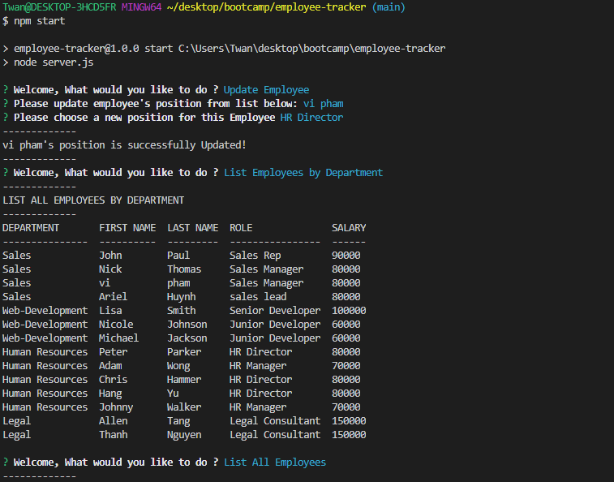

# Employees Tracker
  
  
## Description 
  
This project is to utilize mysql for database and inquirer to prompt user for input. once run npm start, it will connect to database and prompt user to choose an action. User can list all their employees in the company along with their position what department they belong to , and their salary. User also able to sort by department name or position. In addition, user can also modify by adding new role , new department, and new employee. Last user can also remove or update any employees they desire. 


## Table of Contents

* [Installation](#Installation)
* [Usage](#Usage) 
* [Contributing](#Contributing)
* [License](#License)
* [Questions](#Questions)
  

## Installation 
  
Please run the following command to install required software:

```
npm start
```


## Usage

These are the technologies and languages use for this project: mysql, node.js, inquirer

Deployed youtube Link:   https://youtu.be/2KUopj7a4Lg

Github Repository Link: https://github.com/vinhkhamhuynh/employee-tracker
  

  
   
## License 
  


 
This project is licensed under the MIT license. For more information, click here: https://spdx.org/licenses/MIT.html 
 


## Questions
  
Please follow me on Github for more projects: [vinhkhamhuynh](https://github.com/vinhkhamhuynh) 

For any questions or to report issues, please email me at: vinhkhamhuynh@gmail.com
  

